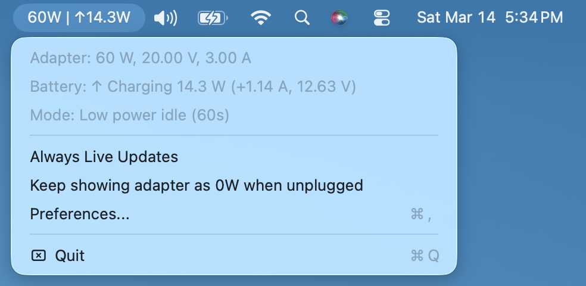
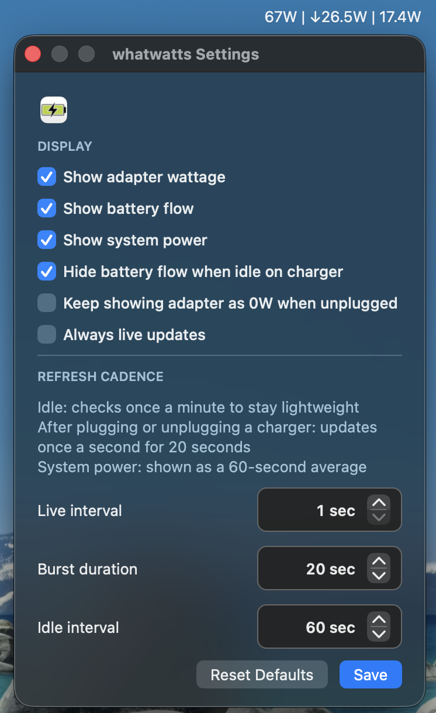

# whatwatts


whatwatts is a lightweight macOS menu bar app for answering one simple question: what is your Mac actually doing right now when you plug in a charger?

It keeps the original WhatWatt idea of showing negotiated adapter wattage, and adds the missing half of the picture: live battery charge and discharge rate.

## Screenshots

Menu bar app:



Preferences:



Built on top of [SomeInterestingUserName/WhatWatt](https://github.com/SomeInterestingUserName/WhatWatt) by Jiawei Chen. The original MIT license is preserved. The upstream PR intentionally keeps the original app name; this public repo uses the `whatwatts` branding.

## Highlights

- Shows adapter wattage and battery power flow in one compact menu bar item
- Uses a clean title format like `67W | ↑18.4W` while charging and `↓18.4W` when unplugged
- Defaults to a low-power refresh mode with fast updates only when charger state changes
- Includes `Always Live Updates` for people who want continuous refreshes
- Includes `Keep showing adapter as 0W when unplugged` if you prefer explicit adapter state in the menu bar
- Adds a lightweight `Preferences...` window for tuning update behavior
- Handles wrapped signed battery current values correctly on Intel Macs

## Why this fork exists

The original app is great at showing what the charger negotiated with macOS. This fork adds the part that is often more useful in practice: whether the battery is actually charging or discharging, and by how much.

That makes it easier to compare chargers, cables, docks, and multi-port power bricks without opening a larger system utility.

## Build

### Xcode

1. Open `WhatWatt.xcodeproj` in Xcode.
2. Select the `WhatWatt` target.
3. Build on the machine architecture you want to ship.

For release builds:

- Intel: build on an Intel Mac to produce an `x86_64` app
- Apple Silicon: build on an Apple Silicon Mac to produce an `arm64` app

This is the supported path for `whatwatts`, and it is the path used for the published release builds.

### Command Line Tools

If you want a local development build without opening Xcode, you can build from the command line with Xcode installed:

```bash
DEVELOPER_DIR=/Applications/Xcode.app/Contents/Developer \
xcodebuild \
  -project WhatWatt.xcodeproj \
  -scheme WhatWatt \
  -configuration Release \
  CODE_SIGNING_ALLOWED=NO \
  -derivedDataPath .derived-data \
  build
```

For an Apple Silicon build:

```bash
DEVELOPER_DIR=/Applications/Xcode.app/Contents/Developer \
xcodebuild \
  -project WhatWatt.xcodeproj \
  -scheme WhatWatt \
  -configuration Release \
  CODE_SIGNING_ALLOWED=NO \
  -derivedDataPath .derived-data-arm64 \
  -arch arm64 \
  build
```

The older `swiftc` path still works for a basic Intel build if you only have Command Line Tools:

```bash
mkdir -p build/whatwatts.app/Contents/MacOS build/whatwatts.app/Contents/Resources
swiftc -sdk /Library/Developer/CommandLineTools/SDKs/MacOSX.sdk \
  -framework Cocoa \
  -framework IOKit \
  WhatWatt/main.swift \
  WhatWatt/AppDelegate.swift \
  WhatWatt/ViewController.swift \
  -o build/whatwatts.app/Contents/MacOS/whatwatts
cp WhatWatt/Info.plist build/whatwatts.app/Contents/Info.plist
codesign --force --deep --sign - build/whatwatts.app
```

## Dependencies

`whatwatts` does not use third-party packages.

It depends on:

- macOS 10.13 or newer
- Xcode for release-quality Intel and Apple Silicon app bundles
- AppKit/Cocoa and IOKit, both provided by macOS

If you only want the fallback Intel-only `swiftc` build, Command Line Tools are enough.

## Releases

The clean distribution strategy is to publish separate binaries by architecture.

- Intel release: build and ship an `x86_64` app bundle on Intel
- Apple Silicon release: build and ship an `arm64` app bundle on Apple Silicon
- Universal release: optional later, only if both sides are built and verified first

That keeps releases explicit and avoids shipping cross-compiled binaries that were never tested on their native platform.

## License and credit

Original project:
- Author: Jiawei Chen
- Repo: [SomeInterestingUserName/WhatWatt](https://github.com/SomeInterestingUserName/WhatWatt)
- License: MIT

This fork remains under the MIT license. See `LICENSE`.
